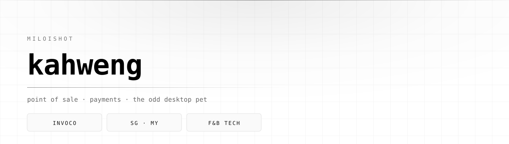

<picture>
  <source media="(prefers-color-scheme: dark)" srcset="./assets/hero-dark.svg">
  
</picture>

  
  
  

  <picture>
    <source media="(prefers-color-scheme: dark)" srcset="https://readme-typing-svg.demolab.com?font=JetBrains+Mono&weight=400&size=17&pause=1600&color=EDEDED&center=true&vCenter=true&width=640&height=34&lines=building+payment+rails+for+F%26B;a+desktop+pet+that+watches+me+code;42+keys%2C+no+regrets">
    
  </picture>

---

## Building

**[Invoco](https://invoco.org)** — a cloud POS for F&B in Singapore and Malaysia, built landlord-first. The operator who owns the food court gets one view across every stall, and payments are part of the product rather than an integration someone else owns. Multi-tenant Postgres with row-level security enforced end to end, edge functions, self-hosted.

Most of it is private. Everything below is what made sense to open up.

<table>
  <tr>
    <td width="50%" valign="top">
      <h3>ganyu-pet</h3>
      
A desktop companion that watches your coding agent work. Hooks into Codex and Claude&nbsp;Code lifecycle events, notices when a test fails or a session drags past midnight, and says one line about it.

      
Quiet by default. Bring your own sprite.

      
<code>Electron</code> &nbsp;<code>Node</code> &nbsp;<code>MIT</code>

      <a href="https://github.com/miloishot/ganyu-pet">Repository&nbsp;→</a>
    </td>
    <td width="50%" valign="top">
      <h3>kw-zmk-corne_config</h3>
      
ZMK firmware for an Eyelash Corne. 42 keys, Windows layout, combos and tap-dances tuned over an embarrassing number of iterations.

      
Flashes from a script or ZMK Studio.

      
<code>ZMK</code> &nbsp;<code>PowerShell</code> &nbsp;<code>Devicetree</code>

      <a href="https://github.com/miloishot/kw-zmk-corne_config">Repository&nbsp;→</a>
    </td>
  </tr>
</table>

---

## Stack

---

## Activity

  <picture>
    <source media="(prefers-color-scheme: dark)" srcset="https://github-readme-stats.vercel.app/api?username=miloishot&show_icons=true&include_all_commits=true&hide_title=true&hide=issues&bg_color=000000&title_color=FFFFFF&text_color=A1A1A1&icon_color=FFFFFF&border_color=2A2A2A&border_radius=8">
    
  </picture>
  <picture>
    <source media="(prefers-color-scheme: dark)" srcset="https://github-readme-stats.vercel.app/api/top-langs/?username=miloishot&layout=compact&hide_title=true&langs_count=6&bg_color=000000&title_color=FFFFFF&text_color=A1A1A1&border_color=2A2A2A&border_radius=8">
    
  </picture>

<picture>
  <source media="(prefers-color-scheme: dark)" srcset="https://raw.githubusercontent.com/miloishot/miloishot/output/snake-dark.svg">
  
</picture>

---

## Elsewhere

Building Invoco full time. Open to talking about POS, payments, or ERP integration work in SG/MY.

**[invoco.org](https://invoco.org)** &nbsp;·&nbsp; **[kw11leong@gmail.com](mailto:kw11leong@gmail.com)**
